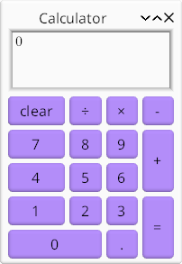

# Calculator: make_widget and grid layout

*Topics: grid layout, accelerator bindings*



The full code for this example [can be found here](https://github.com/kas-gui/tutorials/blob/master/examples/calculator.rs).

## Back-end API

First things first, we should design an API for our implementation (back-end).

Our `Calculator` is simply a machine with some internal state, a method to
`handle` input keys and another method to generate a `display` string.

We define an enum, `Key`, to map each of our buttons to. Since in our example
numeric input (including the decimal point, `.`) will simply get pushed to a
string buffer, we represent these with `Key::Char('0')` etc.

```rust
#[derive(Clone, Debug)]
enum Key {
    Clear, DelBack, Divide, Multiply, Subtract, Add, Equals, Char(char),
}

#[derive(Clone, Debug)]
struct Calculator {
    // ...
}

impl Calculator {
    fn new() -> Calculator {
        Calculator { /* .. */ }
    }

    fn display(&self) -> String {
        todo!()
    }

    // return true if display changes
    fn handle(&mut self, key: Key) -> bool {
        todo!()
    }
}
```

Implementing `Calculator` is left as an exercise to the reader (or use the code
linked above).

## Buttons and key bindings

The string type used for [`TextButton`] labels is [`AccelString`], which
supports simple mark-up: `&clear` adds a binding to key <kbd>c</kbd> and is
displayed as "<u>c</u>lear" (underline only visible when <kbd>Alt</kbd> is held).
We may use this to associate physical keys with our buttons. We may associate
additional keys using [`TextButton::with_keys`]. For example:

-   `TextButton::new_msg("&1", Key::Char('1'))`
-   `TextButton::new_msg("&clear", Key::Clear).with_keys(&[VK::Delete])`
-   `TextButton::new_msg("&=", Key::Equals).with_keys(&[VK::Return, VK::NumpadEnter])`

Note: `VK` is an alias to
[`kas::event::VirtualKeyCode`](https://docs.rs/kas/latest/kas/event/enum.VirtualKeyCode.html),
which is itself a re-export of
[`winit::event::VirtualKeyCode`](https://docs.rs/winit/latest/winit/event/enum.VirtualKeyCode.html).
This type will likely be revised by Winit in the future.

### Button grid

We use `layout = grid: { ... }` to define our buttons. We do so within a
dedicated `Buttons` widget (this is a matter of style; we could directly embed
the grid in `CalcUI`).

```rust
# use kas::event::VirtualKeyCode as VK;
# use kas::prelude::*;
# use kas::widgets::TextButton;
# #[derive(Clone, Debug)]
# enum Key { Clear, DelBack, Divide, Multiply, Subtract, Add, Equals, Char(char) }
impl_scope! {
    #[widget{
        layout = grid: {
            0, 0: TextButton::new_msg("&clear", Key::Clear).with_keys(&[VK::Delete]);
            1, 0: TextButton::new_msg("&÷", Key::Divide).with_keys(&[VK::Slash]);
            2, 0: TextButton::new_msg("&×", Key::Multiply).with_keys(&[VK::Asterisk]);
            3, 0: TextButton::new_msg("&−", Key::Subtract);
            0, 1: TextButton::new_msg("&7", Key::Char('7'));
            1, 1: TextButton::new_msg("&8", Key::Char('8'));
            2, 1: TextButton::new_msg("&9", Key::Char('9'));
            3, 1..3: TextButton::new_msg("&+", Key::Add);
            0, 2: TextButton::new_msg("&4", Key::Char('4'));
            1, 2: TextButton::new_msg("&5", Key::Char('5'));
            2, 2: TextButton::new_msg("&6", Key::Char('6'));
            0, 3: TextButton::new_msg("&1", Key::Char('1'));
            1, 3: TextButton::new_msg("&2", Key::Char('2'));
            2, 3: TextButton::new_msg("&3", Key::Char('3'));
            3, 3..5:  TextButton::new_msg("&=", Key::Equals)
                .with_keys(&[VK::Return, VK::NumpadEnter]);
            0..2, 4: TextButton::new_msg("&0", Key::Char('0'));
            2, 4: TextButton::new_msg("&.", Key::Char('.'));
        };
    }]
    #[derive(Debug, Default)]
    struct Buttons(widget_core!());
}
```

A grid consists of a series of cells, each with syntax `cols, rows: widget;`
where `cols` and `rows` are either a zero-based index or a range (`n` is
equivalent to `n..n+1`).

Above, the "+", "0" and "=" buttons use spans. Note that size allocation
algorithms for spans aren't *perfect*, but much of the time they'll work just
fine (at least, all cells should at least have their *minimum* size requirements
met).

## The calculator widget

We can now define our `CalcUI` widget:
```rust
# use kas::prelude::*;
# use kas::widgets::{EditBox, StrLabel};
# #[derive(Clone, Debug)]
# enum Key { Clear, DelBack, Divide, Multiply, Subtract, Add, Equals, Char(char) }
# type Buttons = StrLabel; // hack
# #[derive(Clone, Debug)] struct Calculator;
# impl Calculator {
    # fn display(&self) -> String { todo!() }
    # fn handle(&mut self, key: Key) -> bool { todo!() }
# }
impl_scope! {
    #[widget{
        layout = column: [
            self.display,
            Buttons::default(),
        ];
    }]
    #[derive(Debug)]
    struct CalcUI {
        core: widget_core!(),
        #[widget] display: EditBox,
        calc: Calculator,
    }

    impl Widget for Self {
        fn handle_message(&mut self, mgr: &mut EventMgr) {
            if let Some(msg) = mgr.try_pop_msg::<Key>() {
                if self.calc.handle(msg) {
                    *mgr |= self.display.set_string(self.calc.display());
                }
            }
        }
    }

    impl Window for Self {
        fn title(&self) -> &str { "Calculator" }
    }
}
```

### Default implementation

Let us implement [`Default`] for `CalcUI` using [`impl_default`]:
```rust,ignore
    #[impl_default]
    // ...
    struct CalcUI {
        core: widget_core!(),
        #[widget] display: EditBox = EditBox::new("0")
            .with_editable(false)
            .with_multi_line(true)
            .with_lines(3, 3)
            .with_width_em(5.0, 10.0),
        calc: Calculator = Calculator::new(),
    }
```
The `widget_core!()` type supports [`Default`]. `Calculator` does not, but it
does have a `new` constructor. [`EditBox`] is a little more interesting: we wish
to use a 3-line box which is not editable. (We could use [`Label`] as in the
Counter example, but [`EditBox`] looks better.)

### Main

We can now define `fn main()` and run our example:
```rust
# use kas::prelude::*;
# use kas::widgets::StrLabel;
# impl_scope! {
#     #[widget{
#         layout = column: [];
#     }]
#     #[derive(Debug, Default)]
#     struct CalcUI {
#         core: widget_core!(),
#     }
#     impl Window for Self {
#         fn title(&self) -> &str { "Calculator" }
#     }
# }
fn main() -> kas::shell::Result<()> {
    env_logger::init();

    let theme = kas::theme::ShadedTheme::new().with_font_size(16.0);
    kas::shell::DefaultShell::new(theme)?
        .with(CalcUI::default())?
        .run()
}
```

## Key bindings, again

If we run the above example, we should see that it works, but ...

-   The key bindings only work while the <kbd>Alt</kbd> key is held. To solve
    this we enable "alt bypass" mode ([`ConfigMgr::enable_alt_bypass`]).
-   The <kbd>Tab</kbd> key navigates the UI, and simply pressing a button will
    leave that button focussed. The <kbd>Enter</kbd> key presses the *focussed*
    button, where as we want it to press the "=" button.

    We solve this by completely disabling navigation with [`ConfigMgr::disable_nav_focus`].
-   The <kbd>Backspace</kbd> key doesn't work. We didn't create a [`TextButton`]
    for this key, but would like the key to map to `Key::DelBack`.

    Solving this is slightly more complex; firstly we use [`ConfigMgr::register_nav_fallback`]
    to ensure otherwise unhandled key presses are sent to our `CalcUI` widget,
    then we implement [`Widget::handle_event`]. Since [`Widget::handle_message`]
    is not called after `handle_event` on the same widget, we update the
    `Calculator` and `self.display` directly.

```rust,ignore
impl Widget for CalcUI {
    fn configure(&mut self, mgr: &mut ConfigMgr) {
        mgr.enable_alt_bypass(self.id_ref(), true);
        mgr.disable_nav_focus(true);
        mgr.register_nav_fallback(self.id());
    }

    fn handle_event(&mut self, mgr: &mut EventMgr, event: Event) -> Response {
        match event {
            Event::Command(Command::DelBack) => {
                if self.calc.handle(Key::DelBack) {
                    *mgr |= self.display.set_string(self.calc.display());
                }
                Response::Used
            }
            _ => Response::Unused,
        }
    }
}
```

## Data models

A final note: we implemented the above without using data models. For the
example as is, this is fine. If we wished to embed `CalcUI` in a more complex
user interface *as a stand-alone calculator*, this would also be fine. But if
we wished to use the calculator's result elsewhere in the UI or in the back-end,
we should probably use a data model.

The first step to doing so would be to put our `Calculator` in a data model,
either by using `SharedRc<Calculator>` (which, with the current data model
traits, would require a clone of the entire `Calculator` each time the display
is updated), or by implementing [`SharedData`] directly (probably using
`type Item = f64;` or `type Item = Result<f64, ParseFloatError>;` as used in
`Calculator`).

Depending on the `Item` type, we may need to implement our own [`Driver`].
The code of `CalcUI::handle_message` would move to the [`Driver::on_message`]
implementation (note: the data (`Calculator` instance) is passed by reference;
this may be updated using [`SharedRc::update_mut`]).

[`AccelString`]: https://docs.rs/kas/latest/kas/text/struct.AccelString.html
[`TextButton`]: https://docs.rs/kas/latest/kas/widgets/struct.TextButton.html
[`TextButton::with_keys`]: https://docs.rs/kas/latest/kas/widgets/struct.TextButton.html#method.with_keys
[`ConfigMgr::enable_alt_bypass`]: https://docs.rs/kas/latest/kas/event/struct.ConfigMgr.html#method.enable_alt_bypass
[`ConfigMgr::disable_nav_focus`]: https://docs.rs/kas/latest/kas/event/struct.ConfigMgr.html#method.disable_nav_focus
[`ConfigMgr::register_nav_fallback`]: https://docs.rs/kas/latest/kas/event/struct.ConfigMgr.html#method.register_nav_fallback
[`impl_default`]: https://docs.rs/impl-tools/latest/impl_tools/attr.impl_default.html
[`Default`]: https://doc.rust-lang.org/stable/std/default/trait.Default.html
[`EditBox`]: https://docs.rs/kas/latest/kas/widgets/struct.EditBox.html
[`Label`]: https://docs.rs/kas/latest/kas/widgets/struct.Label.html
[`Widget::handle_event`]: https://docs.rs/kas/latest/kas/trait.Widget.html#method.handle_event
[`Widget::handle_message`]: https://docs.rs/kas/latest/kas/trait.Widget.html#method.handle_message
[`Driver`]: https://docs.rs/kas/latest/kas/view/trait.Driver.html
[`Driver::on_message`]: https://docs.rs/kas/latest/kas/view/trait.Driver.html#method.on_message
[`SharedData`]: https://docs.rs/kas/latest/kas/model/trait.SharedData.html
[`SharedRc::update_mut`]: https://docs.rs/kas/latest/kas/model/struct.SharedRc.html#method.update_mut
