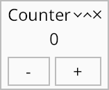

# Counter



This tutorial follows on from [simple window](simple-window.md), turning the example into a counter.

To do this we simply add a button... or not quite so simply, since:

-   a button *must* send a message
-   messages *must* be handled
-   placing multiple widgets next to each other requires a layout widget,
    which in this case also serves as our message handler

I'll just give you our next code sample, then talk about it ([source](https://github.com/kas-gui/tutorials/blob/master/examples/counter.rs)):
```rust
use kas::class::HasString;
use kas::event::{Manager, Response, VoidMsg};
use kas::macros::make_widget;
use kas::widget::{EditBox, TextButton, Window};

fn main() -> Result<(), kas_wgpu::Error> {
    env_logger::init();

    let content = make_widget! {
        #[layout(column)]
        #[handler(msg = VoidMsg)]
        struct {
            #[widget] display: impl HasString = EditBox::new("0").editable(false),
            #[widget(handler = count)] _ = TextButton::new_msg("count", ()),
            counter: u32 = 0,
        }
        impl {
            fn count(&mut self, mgr: &mut Manager, _: ()) -> Response<VoidMsg> {
                self.counter += 1;
                *mgr |= self.display.set_string(self.counter.to_string());
                Response::None
            }
        }
    };
    let window = Window::new("Counter", content);

    let theme = kas_theme::ShadedTheme::new();
    kas_wgpu::Toolkit::new(theme)?.with(window)?.run()
}
```

```sh
cargo run --example counter
```

Whoah... a lot just happened there right? Lets start with the little things:

-   we set `.editable(false)` on our `EditBox` since it is for display only
-   we construct a button: `TextButton::new("count", ())`

Wait, what's that `()` doing there? That is our message. When the button is
clicked, it sends a message to its parent widget, which calls `count`...

### A handler

The `count` method is a handler:

```rust
fn count(&mut self, mgr: &mut Manager, _: ()) -> Response<VoidMsg> {
    self.counter += 1;
    *mgr += self.display.set_string(self.counter.to_string());
    Response::None
}
```
Perfectly ordinary method here. Its parameters are `&mut self` (the widget
doing the handling), `mgr: &mut Manager` (the "event manager"), and `_: ()`
(the message our button passed, which we ignore here).

#### Fields

The first line of `count` is: `self.counter += 1;`. Our method is implemented on our layout
widget, which has a simple field (`counter: u32`) intialised to zero (`= 0`),
so we can just increment it.
(Okay, I might have to explain why the `struct` has no name and `counter: u32 = 0`
all appears in one line — in a minute!)

Back to `count`, the second line calls `self.display.set_string(..)`. As we saw,
`display` is also a field (`display: impl HasString = ...`), even though it is
also a widget. We know this widget implements
[`HasString`], so we can call `set_string` on `display` to update its text.

#### Actions

Now, `set_string` returns a [`TkAction`].
If we ignore it, we see the following when compiling the example:
```
warning: unused `TkAction` that must be used
  --> src/main.rs:20:17
   |
20 |                 self.display.set_string(self.counter.to_string());
   |                 ^^^^^^^^^^^^^^^^^^^^^^^^^^^^^^^^^^^^^^^^^^^^^^^^^^
   |
   = note: `#[warn(unused_must_use)]` on by default
```
In this case, `TkAction` is telling us that we need to *redraw* (since the text
changed). It just so happens that the UI will be redrawn anyway (since the
button was just clicked), but it's good practice to handle actions. The easiest
way to do that is with `*mgr += action` (in KAS 0.7 this will become
`*mgr |= action`). Alternatively we could use [`Manager::send_action`].

#### Messages

*Finally*, `count` returns `Response::None`. *Every* handler and *every*
widget's handler returns [`Response`]
(which is a bit like `Option`, but with `None` / `Msg` / `Unhandled` / ... variants).

`Response` is parametrised with a type called the *message type* — here we have
`Response<VoidMsg>`.

[`VoidMsg`] is a special
message type which cannot exist. Yes, you read that right: it *cannot exist*.
This is distinct from `()` which is a valid type with no data (`Option<()>` can
be `None` or `Some(())`). `Option<VoidMsg>` is a valid type, but it *must* be
`None` since `Some(VoidMsg)` is not valid. In fact, `VoidMsg` is just an enum without
any variants: `enum VoidMsg {}`.

Our button returned `Response::Msg(())` when clicked, which we caught here.
`count` itself doesn't need to send a message to its parent, so we just return
`Response::None`.

### make_widget

Okay, but what was all that weird syntax about?

Quite simply: `make_widget` is a macro. Macros are allowed to invent syntax.
There isn't *really* a good way to document macros, but I tried:
[`kas::macros`]. Lets just go over what we have here though.

First, we have some attributes:
```rust
#[layout(column)]
#[handler(msg = VoidMsg)]
```

`make_widget` only builds one kind of widget: a "parent" containing some number
of child widgets. `layout(column)` places those children in a column (there's also
`single`, `row` and `grid` which we'll see later).

As mentioned above, *every* widget's event handler returns `Response<M>` with
some type `M`, the *message type*. Here we configure the handler with message
type `VoidMsg`.

Aside: `VoidMsg` could and *should* be the default if not specified here, but
using the wrong type currently results in very poor error messages. For this
reason we currently require the message type be given explicitly instead of
assuming a default.

```rust
struct {
    #[widget] display: impl HasString = EditBox::new("0").editable(false),
    #[widget(handler = count)] _ = TextButton::new("count", ()),
    counter: u32 = 0,
}
```
Widgets are, like most complex types, structs. This one doesn't have a name: it
is anonymous. Some languages have built-in support for anonymous types, but
Rust doesn't (at least so far), so we invent some syntax.

Anonymous structs cannot be referred to later, hence they must be constructed
immediately. For this reason we specify each field's type and value at the same
time: `counter: u32 = 0`...

... except that we don't need to specify a type if it can be inferred, so we
could instead write `counter = 0u32`...

... and we don't even need to specify a name for fields we don't need to refer
to later, hence `_ = TextButton::new(..)` only has a value.

One other oddity: `display` has a *bound* `impl HasString` instead of a *type*.
We could just leave the type unnamed, except that, due to limitations of our
improvised support for anonymous types, when we refer to `self.display` later,
Rust cannot access this field if we do not specify a type. We could just specify
the type `EditBox` here (in KAS ≥ 0.7). Instead we just specify a bound:
i.e. the field has some type `T: HasString`.

#### `#[widget]` attribute

The field `display` is a widget. We could simply declare it without the `#[widget]`
attribute, but the widget would not be initialised, would not have space allocated,
be drawn, or receive events. This attribute integrates the new widget in its
parent. (Note that it is not a stand-alone attribute but must be used within
`make_widget!` or `derive(Widget)`.)

The text button's attribute has a parameter: `handler = count`. As mentioned
above, `TextButton` can return a `()` message, and messages *must* be handled.
This binds the method `count` as our handler. (Note that if our layout widget had
message type `()` or any type which `()` can be converted into, we wouldn't have
to specify a handler here — but then we would need another parent around this
widget, since the `Window` widget's child must have message type `VoidMsg`.)

#### methods

Just because our widget is an anonymous struct doesn't mean it can't have methods.
We just specify an impl block — but of course, without a name!
```rust
impl {
    fn count(&mut self, mgr: &mut Manager, _: ()) -> Response<VoidMsg> { .. }
}
```

#### Errata

Our layout widget is *just* a struct with some auto-generated names, plus type
parameters for untyped fields, and trait implementations.
`#[derive(Debug, kas::macros::Widget)]` is implied. Two extra fields are added:
`core` and `layout_data`. `derive(Widget)` is itself a complex macro, and does
the rest. Read more in the [`kas::macros`] documentation.


[`HasString`]: https://docs.rs/kas/latest/kas/class/trait.HasString.html
[`TkAction`]: https://docs.rs/kas/latest/kas/struct.TkAction.html
[`Manager::send_action`]: https://docs.rs/kas/latest/kas/event/struct.Manager.html#method.send_action
[`Response`]: https://docs.rs/kas/latest/kas/event/enum.Response.html
[`VoidMsg`]: https://docs.rs/kas/latest/kas/event/enum.VoidMsg.html
[`kas::macros`]: https://docs.rs/kas/latest/kas/macros/index.html
