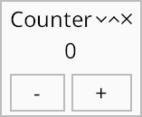

# Counter: a simple widget

*Topics: custom widgets*

Custom widgets are essentially the hard way to do things, but they do have their uses:

-   Custom local state and event handlers are significantly more flexible than [`Adapt`]
-   Custom [`Layout`] implementations and custom mid-level graphics operations (e.g. the [Clock example](https://github.com/kas-gui/kas/tree/master/examples#clock))



Here we rewrite the counter as a custom widget. There's no reason to do so for this particular case, but it serves as a simple example to the topic.

```rust
# extern crate kas;
use kas::prelude::*;
use kas::widgets::{AccessLabel, Button, Row, Text, format_value};

#[derive(Clone, Debug)]
struct Increment(i32);

#[impl_self]
mod Counter {
    #[widget]
    #[layout(column![
        self.display.align(AlignHints::CENTER),
        self.buttons,
    ])]
    struct Counter {
        core: widget_core!(),
        #[widget(&self.count)]
        display: Text<i32, String>,
        #[widget]
        buttons: Row<[Button<AccessLabel>; 2]>,
        count: i32,
    }
    impl Self {
        fn new(count: i32) -> Self {
            Counter {
                core: Default::default(),
                display: format_value!("{}"),
                buttons: Row::new([
                    Button::label_msg("-", Increment(-1)),
                    Button::label_msg("+", Increment(1)),
                ]),
                count,
            }
        }
    }
    impl Events for Self {
        type Data = ();

        fn handle_messages(&mut self, cx: &mut EventCx, data: &()) {
            if let Some(Increment(incr)) = cx.try_pop() {
                self.count += incr;
                cx.update(self.as_node(data));
            }
        }
    }
}

fn main() -> kas::runner::Result<()> {
    env_logger::init();

    let window = Window::new(Counter::new(0), "Counter");

    let theme = kas::theme::SimpleTheme::new();
    let mut app = kas::runner::Runner::with_theme(theme).build(())?;
    let _ = app.config_mut().font.set_size(24.0);
    app.with(window).run()
}
```

## Macros

### `impl_self`

[`impl_self`] is an attribute macro from [impl-tools]. This macro wraps a type definition and `impl`s on that type with a fake module of the same name. This fake module (here `mod Counter`) does not need to import (`use`) symbols from the parent module; in fact it may only contain one type definition with the same name as the fake module and `impl` items on this type.

Unfortunately, rust-analyzer does not fully support this: it may insert `use` statements inside the fake module. It may also mis-report errors against the entire fake module. One may instead use the [`impl_scope!`] macro, however since [`rustfmt` refuses to format its contents](https://github.com/rust-lang/rustfmt/pull/5538) this is the worse option. Perhaps some day this stuff will get fixed?

So, *why* do we have to wrap our widget implementations with a macro? Firstly, it supports `impl Self` syntax. Secondly (and much more importantly), it allows the `#[widget]` macro to operate on the type definition and various widget trait implementations simultaneously. This allows the macro to do useful things, like provide contextual default method implementations, inject debugging checks into provided method implementations, provide contextual warnings, and use a synthesized type to store extra state required by macro-generated layout code.

### `#[widget]`

The [`#[widget]`][attr-widget] attribute-macro is used to implement the [`Widget`] trait. *This is the only supported way to implement [`Widget`].*
```rust,ignore
    #[widget]
    struct Counter { /* .. */ }
```

Like it or not, the `#[widget]` macro is a fairly significant piece of what makes Kas work. Fortunately, most of the complexity is hidden such that you don't need to know about it and can refer to documentation on standard Rust traits.

To get the best diagnostics, be sure to use the `nightly-diagnostics` feature. (Hopefully Rust will stabilize custom proc-macro lints in the next year or so!)

#### Core data

All widgets must have a "core data" field. Typically this is named `core`; it must have type `widget_core!()` and can be initialized using `Default`.
```rust,ignore
        core: widget_core!(),
```

#### Child widgets

There are two types of child widgets: hidden layout-generated children and explicit children. The latter are fields with a `#[widget]` attribute:
```rust,ignore
        #[widget(&self.count)]
        display: Text<i32, String>,
        #[widget]
        buttons: Row<[Button<AccessLabel>; 2]>,
```

The first of these is a [`Text`] widget, passed `&self.count` as input data. The second is a [`Row`] widget over [`Button`]s over [`AccessLabel`]s. Since we didn't specify a data mapping for this second widget, it is is passed the `Count` widget's input data (`()`).

Omitting `#[widget]` on a field which is a child widget is an error; sometimes the outer `#[widget]` attribute-macro will report the issue but not always. For example, if we omit the attribute on `buttons` and run, we get a backtrace like the following:
```
thread 'main' (413532) panicked at /path/to/kas/crates/kas-core/src/core/data.rs:123:13:
WidgetStatus of #INVALID: require Configured, found New
stack backtrace:
   0: __rustc::rust_begin_unwind
             at /rustc/a1208bf765ba783ee4ebdc4c29ab0a0c215806ef/library/std/src/panicking.rs:698:5
   1: core::panicking::panic_fmt
             at /rustc/a1208bf765ba783ee4ebdc4c29ab0a0c215806ef/library/core/src/panicking.rs:75:14
   2: kas_core::core::data::WidgetStatus::require
             at /path/to/kas/crates/kas-core/src/core/data.rs:123:13
   3: kas_core::core::data::WidgetStatus::size_rules
             at /path/to/kas/crates/kas-core/src/core/data.rs:157:18
   4: <kas_widgets::list::List<C,D> as kas_core::core::layout::Layout>::size_rules
             at /path/to/kas/crates/kas-widgets/src/list.rs:207:1
   5: <custom_widget::Counter as kas_core::core::layout::MacroDefinedLayout>::size_rules::{{closure}}
             at ./examples/custom-widget.rs:7:1
  ...
  27: custom_widget::main
             at ./examples/custom-widget.rs:55:22
```
This tells us that some widget should have been `Configured` but had status `New` when calling `size_rules` — because we forgot to say that `buttons` is a `#[widget]` and thus needs to be configured. (This is in fact a debug-mode only check; release builds crash with a much-less-useful backtrace.)

### Layout

All widgets must implement the [`Layout`] trait, but only a few do so directly. Most, instead, use the `#[layout]` attribute-macro.

```rust,ignore
    #[layout(column![
        self.display.align(AlignHints::CENTER),
        self.buttons,
    ])]
    struct Counter { /* .. */ }
```

In this case, we are *not* using the [`column!`] macro (which would not be able to reference `self.display`) but rather an emulation of it. Behaviour should be identical aside from this ability to reference struct fields and not needing to `use kas::widgets::column`.

### Widget traits

[`Widget`] has super-trait [`Tile`] which has super-trait [`Layout`]. Futher, [`Events`] is usually implemented (unless there is no event-handling logic). Impls of any of these traits may appear in a widget implementation, but none are required.

It is however required to define the associated type [`Widget::Data`]. Since it is common to implement [`Events`] instead of [`Widget`] and `trait Events: Widget`, the `#[widget]` macro allows you to take the liberty of defining `type Data` on `Events` instead of `Widget`:
```rust
# extern crate kas;
# use kas::prelude::*;
# #[derive(Clone, Debug)]
# struct Increment(i32);
# impl_scope! {
#     #[widget{
#         layout = "";
#     }]
#     struct Counter {
#         core: widget_core!(),
#         count: i32,
#     }
    impl Events for Self {
        type Data = ();

        fn handle_messages(&mut self, cx: &mut EventCx, data: &()) {
            if let Some(Increment(incr)) = cx.try_pop() {
                self.count += incr;
                cx.update(self.as_node(data));
            }
        }
    }
# }
```

In this case we implement one event-handling method, [`Events::handle_messages`], to update `self.count` when an `Increment` message is received.

#### Updating state

When updating local state in a custom widget, it is requried to explicitly trigger an update to any widgets using that state as their input data. This can be done in a few ways:

-   <code>cx.[action][](self, [Action::UPDATE])</code> will notify that an update to `self` (and children) is required
-   <code>cx.[update][](self.[as_node][](data))</code> will update `self` (and children) immediately
-   <code>cx.[update][](self.display.[as_node][](&self.count))</code> will update `self.display` immediately

Note that previously:

-   We used [`Adapt::on_message`] to update state: this automatically updates children
-   We used [`AppData::handle_messages`]: again, this automatically updates children

Custom widgets are not the same in this regard.

Don't worry about remembering each step; macro diagnostics should point you in the right direction. Detection of fields which are child widgets is however imperfect (nor can it be), so try to at least remember to apply `#[widget]` attributes.

### Aside: the type of child widgets

Our `Counter` has two (explicit) child widgets, and we must specify the type of each:
```rust
# extern crate kas;
# use kas::impl_scope;
# use kas::widgets::{AccessLabel, Button, Row, Text};
# impl_scope! {
#     #[widget{
#         Data = ();
#         layout = "";
#     }]
#     struct Counter {
#         core: widget_core!(),
        #[widget(&self.count)]
        display: Text<i32, String>,
        #[widget]
        buttons: Row<[Button<AccessLabel>; 2]>,
#         count: i32,
#     }
# }
```
There is no real issue in this case, but widget types can get significantly harder to write than `Row<[Button<AccessLabel>; 2]>`. Worse, some widget types are impossible to write (e.g. the result of [`row!`] or widget generics instantiated with a closure). So what can we do instead?

-   It would be nice if `impl Widget<Data = ()>` worked; alas, it does not, and I have seen little interest in support for field-position-impl-trait. But I believe Rust *could* support this.
-   Rust may stabilise support for [`impl Trait` in type aliases](https://doc.rust-lang.org/nightly/unstable-book/language-features/type-alias-impl-trait.html) "soon". This requires writing a type-def outside of the widget definition but is supported in nightly Rust:

    ```rust,ignore
    type MyButtons = impl Widget<Data = ()>;
    ```
-   We could use a `Box`: `Box<dyn Widget<Data = ()>>`.
-   We could embed our `buttons` in the `#[layout]` instead of using a field. This is not always possible (e.g. for `display` which takes `&self.count` as input data). Since `#[layout]` uses `Box` internally this is effectively the same as above.
-   The [`impl_anon!`] macro *does* support `impl Trait` syntax. The required code is unfortunately *a bit* hacky (hidden type generics) and at least a little prone to spitting out misleading error messages instead of *just working*. Best practice is to cross your fingers.

[`impl_self`]: https://docs.rs/impl-tools/latest/impl_tools/attr.impl_self.html
[`impl_scope!`]: https://docs.rs/impl-tools/latest/impl_tools/macro.impl_scope.html
[`impl_anon!`]: https://docs.rs/impl-tools/latest/impl_tools/macro.impl_anon.html
[attr-widget]: https://docs.rs/kas/latest/kas/attr.widget.html
[`Widget`]: https://docs.rs/kas/latest/kas/trait.Widget.html
[`Widget::Data`]: https://docs.rs/kas/latest/kas/trait.Widget.html#associatedtype.Data
[`Tile`]: https://docs.rs/kas/latest/kas/trait.Tile.html
[`Events`]: https://docs.rs/kas/latest/kas/trait.Events.html
[`Events::handle_messages`]: https://docs.rs/kas/latest/kas/trait.Events.html#method.handle_messages
[`Default`]: https://doc.rust-lang.org/stable/std/default/trait.Default.html
[`Layout`]: https://docs.rs/kas/latest/kas/trait.Layout.html
[impl-tools]: https://crates.io/crates/impl-tools
[`CoreData`]: https://docs.rs/kas/latest/kas/struct.CoreData.html
[`Label`]: https://docs.rs/kas/latest/kas/widgets/struct.Label.html
[`Text`]: https://docs.rs/kas/latest/kas/widgets/struct.Text.html
[`kas::resvg::Canvas`]: https://docs.rs/kas/latest/kas/resvg/struct.Canvas.html
[`column!`]: https://docs.rs/kas/latest/kas/widgets/macro.column.html
[`row!`]: https://docs.rs/kas/latest/kas/widgets/macro.row.html
[`Button`]: https://docs.rs/kas/latest/kas/widgets/struct.Button.html
[`Row`]: https://docs.rs/kas/latest/kas/widgets/struct.Row.html
[`AccessLabel`]: https://docs.rs/kas/latest/kas/widgets/struct.AccessLabel.html
[action]: https://docs.rs/kas/latest/kas/event/struct.EventState.html#method.action
[update]: https://docs.rs/kas/latest/kas/event/struct.EventCx.html#method.update
[Action::UPDATE]: https://docs.rs/kas/latest/kas/struct.Action.html#associatedconstant.UPDATE
[as_node]: https://docs.rs/kas/latest/kas/trait.Widget.html#method.as_node
[`Adapt::on_message`]: https://docs.rs/kas/latest/kas/widgets/struct.Adapt.html#method.on_message
[`AppData::handle_messages`]: https://docs.rs/kas/latest/kas/app/trait.AppData.html#tymethod.handle_messages
