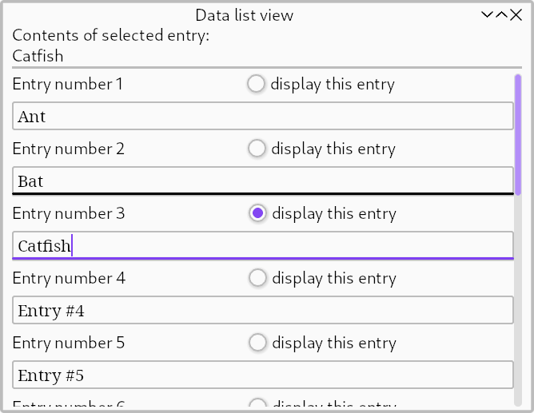

# Data list view

*Topics: view widgets, clerks*



## Problem

This tutorial will concern building a front-end to a very simple database.

Context: we have a database consisting of a set of `String` values, keyed by sequentially-assigned (but not necessarily contiguous) `usize` numbers. One key is deemed active. In code:
```rust
#[derive(Debug)]
struct MyData {
    active: usize,
    strings: HashMap<usize, String>,
}

impl MyData {
    fn new() -> Self {
        MyData {
            active: 0,
            strings: HashMap::new(),
        }
    }
    fn get_string(&self, index: usize) -> String {
        self.strings
            .get(&index)
            .cloned()
            .unwrap_or_else(|| format!("Entry #{}", index + 1))
    }
}
```

Our very simple database supports two mutating operations: selecting a new key to be active and replacing the string value at a given key:
```rust
#[derive(Clone, Debug)]
enum Control {
    Select(usize),
    Update(usize, String),
}
# struct MyData {
#     active: usize,
#     strings: HashMap<usize, String>,
# }

impl MyData {
    fn handle(&mut self, control: Control) {
        match control {
            Control::Select(index) => {
                self.active = index;
            }
            Control::Update(index, text) => {
                self.strings.insert(index, text);
            }
        };
    }
}
```


## The view widget

We wish to display our database as a sequence of "view widgets", each tied to a single key. We will start by designing such a "view widget".

### Input data

Each item consists of a `key: usize` and `value: String`. Additionally, an item may or may not be active. Since we don't need to pass static (unchanging) data on update, we will omit `key`. Though we could pass `is_active: bool`, it turns out to be just as easy to pass `active: usize`.

The input data to our view widget will therefore be:
```rust
type MyItem = (usize, String); // (active index, entry's text)
```

### Edit fields and guards

We choose to display the `String` value in an [`EditBox`], allowing direct editing of the value. To fine-tune behaviour of this [`EditBox`], we will implement a custom [`EditGuard`]:

```rust
#[derive(Debug)]
struct ListEntryGuard(usize);
impl EditGuard for ListEntryGuard {
    type Data = MyItem;

    fn update(&mut self, edit: &mut Editor, cx: &mut ConfigCx, data: &MyItem) {
        edit.set_string(cx, data.1.to_string());
    }

    fn activate(&mut self, _: &mut Editor, cx: &mut EventCx, _: &MyItem) -> IsUsed {
        cx.push(Control::Select(self.0));
        Used
    }

    fn edit(&mut self, edit: &mut Editor, cx: &mut EventCx, _: &MyItem) {
        cx.push(Control::Update(self.0, edit.clone_string()));
    }
}
```

### The view widget

The view widget itself is a custom widget:
```rust
#[impl_self]
mod ListEntry {
    // The list entry
    #[widget]
    #[layout(column! [
        row! [self.label, self.radio],
        self.edit,
    ])]
    struct ListEntry {
        core: widget_core!(),
        #[widget(&())]
        label: Label<String>,
        #[widget]
        radio: RadioButton<MyItem>,
        #[widget]
        edit: EditBox<ListEntryGuard>,
    }

    impl Events for Self {
        type Data = MyItem;
    }
}
```
(In fact, the primary reason to use a custom widget here is to have a named widget type.)

### The driver

To use `ListEntry` as a view widget, we need a driver:
```rust
struct ListEntryDriver;
impl Driver<usize, MyItem> for ListEntryDriver {
    const TAB_NAVIGABLE: bool = true;

    type Widget = ListEntry;

    fn make(&mut self, key: &usize) -> Self::Widget {
        let n = *key;
        ListEntry {
            core: Default::default(),
            label: Label::new(format!("Entry number {}", n + 1)),
            radio: RadioButton::new_msg(
                "display this entry",
                move |_, data: &MyItem| data.0 == n,
                move || Control::Select(n),
            ),
            edit: EditBox::new(ListEntryGuard(n)),
        }
    }

    fn navigable(_: &Self::Widget) -> bool {
        false
    }
}
```

## A scrollable view over data entries

We've already seen the [`column!`] macro which allows easy construction of a fixed-size vertical list. This macro constructs a <code>[Column]&lt;C&gt;</code> widget over a synthesized [`Collection`] type, `C`
If we instead use <code>[Column]&lt;Vec&lt;ListEntry&gt;&gt;</code> we can extend the column dynamically.

Such an approach (directly representing each data entry with a widget) is scalable to *at least* 10'000 entries, assuming one is prepared for some delays when constructing and resizing the UI. If we wanted to scale this further, we could page results, or try building a façade which dymanically re-allocates view widgets as the view is scrolled ...

... but wait, Kas already has that. It's called [`ListView`]. Lets use it.

### Data clerks

To drive [`ListView`], we need a [clerk]. All clerks must implement [`Clerk`]:
```rust
#[derive(Default)]
struct Generator;

impl Clerk<usize> for Generator {
    type Data = MyData;
    type Item = MyItem;

    fn len(&self, data: &Self::Data, lbound: usize) -> Len<usize> {
        todo!()
    }
}
```

### Data generators

We determined our view widget's input data type above: `type MyItem = (usize, String);`. Our implementation just needs to generate values of this type on demand. (And since input data must be passed by a single reference, we cannot pass our data as `(usize, &str)` here. We could instead pass `(usize, Rc<Box<String>>)` to avoid deep-cloning `String`s, but in this little example there is no need.)

Thus, we can also implement [`IndexedGenerator`]:
```rust
# #[derive(Default)]
# struct Generator;
#
# impl Clerk<usize> for Generator {
#     type Data = MyData;
#     type Item = MyItem;
#
#     fn len(&self, data: &Self::Data, lbound: usize) -> Len<usize> {
#         todo!()
#     }
# }
#
impl IndexedGenerator<usize> for Generator {
    fn update(&mut self, data: &Self::Data) -> GeneratorChanges<usize> {
        todo!()
    }

    fn generate(&self, data: &Self::Data, index: usize) -> Self::Item {
        (data.active, data.get_string(index))
    }
}
```

Returning [`GeneratorChanges::Any`] from fn [`IndexedGenerator::update`] is never wrong, yet it may cause unnecessary work. It turns out that we can simply calculate necessary updates in fn `MyData::handle`. (This assumes that `MyData::handle` will not be called multiple times before [`IndexedGenerator::update`].)

Before we amend `MyData`, we should look at fn [`Clerk::len`], which affects both the items our view controller might try to generate and the length of scroll bars. The return type is [`Len`] (with `Index=usize` in our case):
```rust
pub enum Len<Index> {
    Known(Index),
    LBound(Index),
}
```
`MyData` does not have a limit on its data length (aside from `usize::MAX` and the amount of memory available to `HashMap`, both of which we shall ignore). We do have a known lower bound: the last (highest) key value used.

At this point, we could decide that the highest addressible key is `data.last_key + 1` and therefore return `Len::Known(data.last_key + 2)`. Instead, we'd like to support unlimited scrolling (like in spreadsheets); following the recommendations on [`Clerk::len`] thus leads to the following implementation:
```rust
    fn len(&self, data: &Self::Data, lbound: usize) -> Len<usize> {
        Len::LBound((data.active.max(data.last_key + 1).max(lbound))
    }
```

Right, lets update `MyData` with these additional capabilities:
```rust
#[derive(Debug)]
struct MyData {
    last_change: GeneratorChanges<usize>,
    last_key: usize,
    active: usize,
    strings: HashMap<usize, String>,
}

impl MyData {
    fn handle(&mut self, control: Control) {
        match control {
            Control::Select(index) => {
                self.last_change = GeneratorChanges::Any;
                self.active = index;
            }
            Control::Update(index, text) => {
                self.last_change = GeneratorChanges::Range(index..index + 1);
                self.last_key = self.last_key.max(index);
                self.strings.insert(index, text);
            }
        }
    }
}
```

## ListView

Now we can write `fn main`:
```rust
fn main() -> kas::runner::Result<()> {
    env_logger::init();

    let clerk = Generator::default();
    let list = ListView::down(clerk, ListEntryDriver);
    let tree = column![
        "Contents of selected entry:",
        Text::new_gen(|_, data: &MyData| data.get_string(data.active)),
        Separator::new(),
        ScrollRegion::new_viewport(list).with_fixed_bars(false, true),
    ];

    let ui = tree
        .with_state(MyData::new())
        .on_message(|_, data, control| data.handle(control));

    let window = Window::new(ui, "Data list view");

    kas::runner::Runner::new(())?.with(window).run()
}
```

The [`ListView`] widget controls our view. We construct with direction `down`, a [`IndexedGenerator`] and our `ListEntryDriver`. Done.

[Full code can be found here](https://github.com/kas-gui/tutorials/blob/master/examples/data-list-view.rs).

[`EditBox`]: https://docs.rs/kas/latest/kas/widgets/struct.EditBox.html
[`EditGuard`]: https://docs.rs/kas/latest/kas/widgets/trait.EditGuard.html
[`GeneratorChanges::Any`]: https://docs.rs/kas/latest/kas/view/clerk/enum.GeneratorChanges.html#variant.Any
[`IndexedGenerator`]: https://docs.rs/kas/latest/kas/view/clerk/trait.IndexedGenerator.html
[`IndexedGenerator::update`]: https://docs.rs/kas/latest/kas/view/clerk/trait.IndexedGenerator.html#tymethod.update
[`Len`]: https://docs.rs/kas/latest/kas/view/clerk/enum.Len.html
[`Len::Known`]: https://docs.rs/kas/latest/kas/view/clerk/enum.Len.html
[`ListView`]: https://docs.rs/kas/latest/kas/view/struct.ListView.html
[clerk]: https://en.wiktionary.org/wiki/clerk
[`Clerk`]: https://docs.rs/kas/latest/kas/view/clerk/trait.Clerk.html
[`Clerk::len`]: https://docs.rs/kas/latest/kas/view/clerk/trait.Clerk.html#tymethod.len
[`column!`]: https://docs.rs/kas/latest/kas/widgets/macro.column.html
[Column]: https://docs.rs/kas/latest/kas/widgets/type.Column.html
[`Collection`]: https://docs.rs/kas/latest/kas/trait.Collection.html
