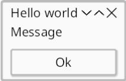

# Hello World!

*Topics: logging, shell, run*



Lets get started with a simple message box.
[Source](https://github.com/kas-gui/tutorials/blob/master/examples/hello.rs).

```rust
use kas::widgets::dialog::MessageBox;

fn main() -> Result<(), Box<dyn std::error::Error>> {
    env_logger::init();

    let window = MessageBox::new("Message", "Hello world");

    let theme = kas::theme::FlatTheme::new();
    kas::shell::DefaultShell::new(theme)?.with(window)?.run()
}
```

```sh
cargo run --example hello
```

## Logging

Enabling a logger is optional, but can be very useful for debugging:
```rust
env_logger::init();
```
KAS uses the [`log`](https://crates.io/crates/log) facade internally. To see the
output, we need an implementation, such as
[`env_logger`](https://crates.io/crates/env_logger).

Trace level can be a bit chatty; to get a *reasonable* level of output you might
try this:
```sh
export RUST_LOG=warn,naga=error,kas=debug
cargo run --example hello
```

## A window, a shell

Next, we define our window. For this example, we use [`kas::widgets::dialog::MessageBox`].
```rust
# use kas::widgets::dialog::MessageBox;
let window = MessageBox::new("Message", "Hello world");
```
This line doesn't actually *do* anything besides creating a "window" object.
A window is any type implementing the [`Window`] trait.

```rust
# use kas::widgets::dialog::MessageBox;
# fn main() -> Result<(), Box<dyn std::error::Error>> {
# let window = MessageBox::new("Message", "Hello world");
let theme = kas::theme::FlatTheme::new();
kas::shell::DefaultShell::new(theme)?.with(window)?.run()
# }
```

[`kas::shell::DefaultShell`] is the "shell", providing bindings to windowing and
graphics functionality (at the time of writing, via Winit and WGPU).
One *could* write their own shell (e.g. to embed KAS), but that would be an
advanced topic (and breaking new ground).

High-level drawing and sizing is handled by a "theme", which we provide to the
shell. Writing a custom theme is another advanced (but better tested) topic.
Here we just use [`FlatTheme`].

Finally, [`Shell::run`] starts our UI. This method does not return (see
[`winit::event_loop::EventLoop::run`] documentation).

The shell (and program) will exit after all windows have closed.

[`winit::event_loop::EventLoop::run`]: https://docs.rs/winit/latest/winit/event_loop/struct.EventLoop.html#method.run
[`kas_theme::FlatTheme`]: https://docs.rs/kas-theme/latest/kas_theme/struct.FlatTheme.html
[`kas::shell::DefaultShell`]: https://docs.rs/kas/latest/kas/shell/struct.DefaultShell.html
[`Shell::run`]: https://docs.rs/kas/latest/kas/shell/struct.Shell.html#method.run
[`kas::widgets::dialog::MessageBox`]: https://docs.rs/kas/latest/kas/widgets/dialog/struct.MessageBox.html
[`Window`]: https://docs.rs/kas/latest/kas/trait.Window.html
[`FlatTheme`]: https://docs.rs/kas/latest/kas/theme/struct.FlatTheme.html
