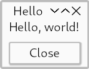

# Hello World!



Lets get started with a simple message box.
[Source](https://github.com/kas-gui/tutorials/blob/master/examples/hello.rs).

```rust
use kas::widgets::dialog::MessageBox;

fn main() -> Result<(), Box<dyn std::error::Error>> {
    let window = MessageBox::new("Message", "Hello world");

    let theme = kas::theme::FlatTheme::new();
    kas::shell::Toolkit::new(theme)?.with(window)?.run()
}
```

```sh
cargo run --example hello
```

Lets start from the bottom up...

`kas::shell::Toolkit` is the "shell", providing bindings to windowing and
graphics functionality (at the time of writing, via Winit and WGPU).
One *could* write their own shell (e.g. to embed KAS), but that would be an
advanced topic (and breaking new ground).

High-level drawing and sizing is handled by a "theme", which we provide to the
toolkit. Writing a custom theme is another advanced (but better tested) topic.

[`Toolkit::with`] expects a `dyn` [`Window`] object; we use [`MessageBox`].

Finally, [`Toolkit::run`] starts our UI. This method does not return (it uses
[`winit::event_loop::EventLoop::run`]).
The program will exit after all windows have closed.

[`env_logger`]: https://docs.rs/env_logger
[`winit::event_loop::EventLoop::run`]: https://docs.rs/winit/0.24/winit/event_loop/struct.EventLoop.html#method.run
[`env_logger::init`]: https://docs.rs/env_logger/0.8/env_logger/fn.init.html
[`kas_theme::ShadedTheme`]: https://docs.rs/kas-theme/latest/kas_theme/struct.ShadedTheme.html
[`kas_wgpu::Toolkit`]: https://docs.rs/kas-wgpu/latest/kas_wgpu/struct.Toolkit.html
[`TextButton`]: https://docs.rs/kas/latest/kas/widget/struct.TextButton.html
[`Manager`]: https://docs.rs/kas/latest/kas/event/struct.Manager.html
