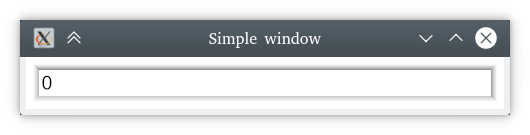

# Simple window



Lets start by building a *really* simple UI, containing just an edit-box.
(This is basically just a template. [Source](https://github.com/kas-gui/tutorials/blob/master/examples/counter.rs).)

```rust
use kas::widget::{EditBox, Window};

fn main() -> Result<(), kas_wgpu::Error> {
    env_logger::init();

    let content = EditBox::new("0");
    let window = Window::new("Simple window", content);

    let theme = kas_theme::ShadedTheme::new();
    kas_wgpu::Toolkit::new(theme)?.with(window)?.run()
}
```

Hopefully that is clear enough? Let me explain anyway:

-   our `main` function may fail with the `kas_wgpu::Error` type; `Toolkit::new`
    and `Toolkit::with` can fail (the `?` "try" operator)
-   we initialise a logger, [`env_logger`] (optional,
    but lets us get useful messages; try setting the environment variable
    `RUST_LOG=kas=info` or `trace` before running the example)
-   we construct an `EditBox` and a `Window` around that
-   we use the `ShadedTheme` (with default colours)
-   we initialise the toolkit with our theme, add our window, and run it

Note that `Toolkit::run` does not return. It is in fact a wrapper around
[`winit::event_loop::EventLoop::run`], which does not return.
By default, the program will exit after all windows have closed.

Also note that we only import our widgets into the module (`use kas::widget::{..}`),
but don't import anything from the other crates: we use [`env_logger::init`],
[`kas_theme::ShadedTheme`] and [`kas_wgpu::Toolkit`] directly since we don't need
any other items from these crates.


[`env_logger`]: https://docs.rs/env_logger
[`winit::event_loop::EventLoop::run`]: https://docs.rs/winit/0.24.0/winit/event_loop/struct.EventLoop.html#method.run
[`env_logger::init`]: https://docs.rs/env_logger/0.8.2/env_logger/fn.init.html
[`kas_theme::ShadedTheme`]: https://docs.rs/kas-theme/0.6.0/kas_theme/struct.ShadedTheme.html
[`kas_wgpu::Toolkit`]: https://docs.rs/kas-wgpu/0.6.0/kas_wgpu/struct.Toolkit.html
