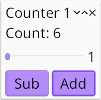
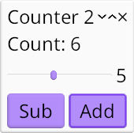

# Sync-counter: data models

*Topics: top-level `AppData`, multiple windows*




We complicate the previous example just a little bit!

```rust
# extern crate kas;
use kas::widgets::{format_data, label_any, Adapt, Button, Slider};
use kas::{messages::MessageStack, Action, Window};

#[derive(Clone, Debug)]
struct Increment(i32);

#[derive(Clone, Copy, Debug)]
struct Count(i32);

impl kas::app::AppData for Count {
    fn handle_messages(&mut self, messages: &mut MessageStack) -> Action {
        if let Some(Increment(add)) = messages.try_pop() {
            self.0 += add;
            Action::UPDATE
        } else {
            Action::empty()
        }
    }
}

fn counter() -> impl kas::Widget<Data = Count> {
    // Per window state: (count, increment).
    type Data = (Count, i32);
    let initial: Data = (Count(0), 1);

    #[derive(Clone, Debug)]
    struct SetValue(i32);

    let slider = Slider::right(1..=10, |_, data: &Data| data.1).with_msg(SetValue);
    let ui = kas::column![
        format_data!(data: &Data, "Count: {}", data.0.0),
        row![slider, format_data!(data: &Data, "{}", data.1)],
        row![
            Button::new(label_any("Sub")).with(|cx, data: &Data| cx.push(Increment(-data.1))),
            Button::new(label_any("Add")).with(|cx, data: &Data| cx.push(Increment(data.1))),
        ],
    ];

    Adapt::new(ui, initial)
        .on_update(|_, state, count| state.0 = *count)
        .on_message(|_, state, SetValue(v)| state.1 = v)
}

fn main() -> kas::app::Result<()> {
    env_logger::init();

    let theme = kas_wgpu::ShadedTheme::new().with_font_size(24.0);

    kas::app::Default::with_theme(theme)
        .build(Count(0))?
        .with(Window::new(counter(), "Counter 1"))
        .with(Window::new(counter(), "Counter 2"))
        .run()
}
```

## AppData

In the previous example, our top-level `AppData` was `()`: `.build(())`.

This time, we want to store our counter in top-level `AppData`. But, as we saw with `Adapt`, state which doesn't react to messages is useless; hence we use a custom type and implement a message handler:
```rust
# extern crate kas;
# use kas::{messages::MessageStack, Action};
# #[derive(Clone, Debug)]
# struct Increment(i32);

#[derive(Clone, Copy, Debug)]
struct Count(i32);

impl kas::app::AppData for Count {
    fn handle_messages(&mut self, messages: &mut MessageStack) -> Action {
        if let Some(Increment(add)) = messages.try_pop() {
            self.0 += add;
            Action::UPDATE
        } else {
            Action::empty()
        }
    }
}
```
[`AppData::handle_messages`] is less succinct than [`Adapt::on_message`], but dones the same job. The method notifies when widgets must be updated by returning [`Action::UPDATE`].

### As an input

We initialise our app with an instance of `Count`: `.build(Count(0))`.

Note that `Count` is now an input to the widgets we construct:
```rust
# extern crate kas;
# use kas::{messages::MessageStack, Action};
# #[derive(Clone, Copy, Debug)]
# struct Count(i32);
# impl kas::app::AppData for Count {
#     fn handle_messages(&mut self, messages: &mut MessageStack) -> Action { Action::empty() }
# }
fn counter() -> impl kas::Widget<Data = Count> {
    // ...
    # kas::widgets::label_any("")
}
```

### Adapting app data

We could at this point simply repeat the previous example, skipping the [`Adapt`] node since our [`AppData`] implementation already does the work. But lets make things more interesting by combining top-level state with local state.

We define a new data type for local state and construct an initial instance:
```rust
# #[derive(Clone, Copy, Debug)]
# struct Count(i32);
// Per window state: (count, increment).
type Data = (Count, i32);
let initial: Data = (Count(0), 1);
```
Note that our local data includes a *copy* of the top-level data `Count` (along with an initial value, `Count(0)`, which will be replaced before it is ever used).

We'll skip right over the widget declarations to the new `Adapt` node:
```rust
# extern crate kas;
# use kas::widgets::{label_any, Adapt};
# #[derive(Clone, Copy, Debug)]
# struct Count(i32);
# fn counter() -> impl kas::Widget<Data = Count> {
# #[derive(Clone, Debug)]
# struct SetValue(i32);
# let ui = label_any("");
# let initial = (Count(0), 1);
Adapt::new(ui, initial)
    .on_update(|_, state, count| state.0 = *count)
    .on_message(|_, state, SetValue(v)| state.1 = v)
# }
```
The notable addition here is [`Adapt::on_update`], which takes a closure over the expected mutable reference to local `state` as well as *input* data `count` (i.e. the top-level data), allowing us to update local state with the latest top-level `count`.

Aside: this is really not how *adapting* top-level data with local state is *supposed* to work. Ideally, we'd omit the local copy of `Count` entirely and pass something like `(&Count, i32)` to local widgets. But, as any Rustacean knows, a reference requires a lifetime, and dealing with lifetimes can get complicated. The plan is to update our approach once Rust supports object-safe GATs (also known as Extended Generic Associated Types).

## Multiple windows

It barely seems worth mentioning, but there's nothing stopping us from calling `fn counter` multiple times and constructing a new window around each:
```rust
# extern crate kas;
# use kas::{messages::MessageStack, Action, Window};
# #[derive(Clone, Copy, Debug)]
# struct Count(i32);
# impl kas::app::AppData for Count {
#     fn handle_messages(&mut self, messages: &mut MessageStack) -> Action { Action::empty() }
# }
# fn counter() -> impl kas::Widget<Data = Count> {
#     kas::widgets::label_any("")
# }
# fn main() -> kas::app::Result<()> {
# let theme = kas_wgpu::ShadedTheme::new().with_font_size(24.0);
kas::app::Default::with_theme(theme)
    .build(Count(0))?
    .with(Window::new(counter(), "Counter 1"))
    .with(Window::new(counter(), "Counter 2"))
    .run()
# }
```
Of course, each window has its own local state stored in its [`Adapt`] node (the `increment`) while sharing the top-level `Count`.

[`AppData`]: https://docs.rs/kas/latest/kas/app/trait.AppData.html
[`AppData::handle_messages`]: https://docs.rs/kas/latest/kas/app/trait.AppData.html#tymethod.handle_messages
[`Adapt`]: https://docs.rs/kas/latest/kas/widgets/struct.Adapt.html
[`Adapt::on_message`]: https://docs.rs/kas/latest/kas/widgets/struct.Adapt.html#method.on_message
[`Action::UPDATE`]: https://docs.rs/kas/latest/kas/struct.Action.html#associatedconstant.UPDATE
[`Adapt::on_update`]: https://docs.rs/kas/latest/kas/widgets/struct.Adapt.html#method.on_update
